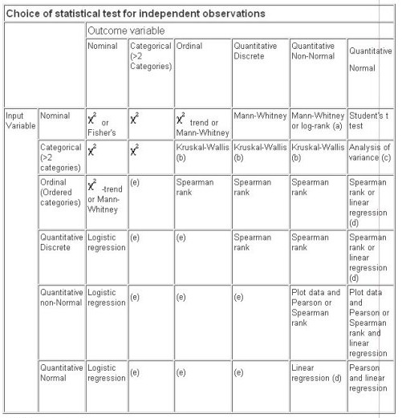

## Title and abstract

**Study Design**

Remember to use **PICO**

**1.Patient population**

#In patients being investigated for GORD with a negative pH impedance study 

**2.Intervention**

#who go on to have a BRAVO study

**3.Comparison**

Is there a significant increase between the two tests

**4.Outcome**

in the patients who have GORD

**5. Further**

What can predict a BRAVO positive, pH impedance negative investigation to support a Straight-to-BRAVO test?


**Diagnosis** a) In patients being investigated for GORD with a negative impedance study for GORD who go on to have a BRAVO study, what proportion have a positive BRAVO for GORD condition


**$\color{red}{\text{A.Indicate the study’s design with a commonly used term in the title or the abstract}}$.**

**Example 1**

Title: ‘An observational study with long-term follow-up of canine cognitive dysfunction: Clinical characteristics, survival
and risk factors’ (Fast et al., 2013).

Example 2
Title: ‘Case-control study of risk factors associated with Brucella melitensis on goat farms in Peninsular Malaysia’ (Bamaiyi et al., 2014).

**Explanation **
Including the study design term in the title or abstract when a standard study design is used, or at least identifying that a study is observational, allows the reader to easily identify the design and helps to ensure that articles are correctly indexed in electronic databases (Benson and Hartz, 2000). In STROBE, item 1a only requests that a common study design term be used. However, in veterinary research, not all observational studies are easily categorized into cohort, case–control, or cross-sectional study designs. Therefore, we recommend including that the study was observational and, if possible, the study design or important design characteristics, for example longitudinal, in the title.


---
title: "Template for STROBE presentation at conference abstracts"
author: "Sebastian Zeki"
date: "04/09/2018"
output: html_document
---

```{r setup, include=FALSE}
knitr::opts_chunk$set(echo = TRUE)
```

## Introduction

**$\color{red}{\text{B.Introductory sentence 1: Define the disease condition}}$.**

**eg** Aperistaltic oesophagus is a term that covers all conditions where achalasia is absent and there is no peristaltic activity


**$\color{red}{\text{C.Introductory sentence 2: The overview of the disease condition}}$.**

**eg** Aperistaltic oesophagus remains a difficult condition to treat with no specific and effective treatments

**$\color{red}{\text{D.Introductory sentence 3: The problem being addressed}}$.**

**eg** The number of non-achalasia aperistaltic oesophagus patients is unknown.

**eg** Although often isolated from outpatients in veterinary clinics, there is concern that MRSP follows a veterinary-hospital associated epidemiology


```{r Introduction}

```

## Aim


**eg** The aim of the study was to assess the number of patients with aperistaltic oesophagus without achalasia and ascertain their demographics


```{r Aim}
```


## Methods


**$\color{red}{\text{E.Define the Dates}}$.**

Get the dates from the minimum of the VisitDate column `r 1+1 `

**$\color{red}{\text{F.Define the Location}}$.**
Standard sentence here about GSTT
The results of high resolution studies performed in patients with cough as part of the presenting complaint to the gastroenterology service at Guy's and St Thomas' NHS Trust were examined retrospectively between June 2008 and January 2018. 

**$\color{red}{\text{F.Define the Eligibility}}$.**
All patients selected were adults over the age of 18. Ethics was approved (IRAS number) and by the local ethics board.

**$\color{red}{\text{F.Define the Exclusion}}$.**
Patients with incomplete data sets were exluded from the study. Where x was not available fromt the report, the raw file was located and manually analysed

**$\color{red}{\text{G.Define the Sampling}}$.**

Patients were selected according to Chicago Classification v3. Patients symptoms were selected from self reporting at impedance if this was done at the same time as high resolution manometry. If this was not the case then the symptoms were extracted either from the final report summarising the patient's condition and physiological diagnosis, or from the clinicians details when ordering the investigation.

**$\color{red}{\text{H.Define the data cleaning methodology methods}}$.**

This involves how the relevant columns were accordionised (eg categorising the patients/and how subgroups were formed).


```{r Methods}
library(PhysiMineR)
library(DiagrammeR)
library(CodeDepends)
library(tidyverse)

######################################### Data acquisiton######################################### 

#library(RODBC)
#channel <- odbcConnectAccess("S:\\Gastroenterology\\Seb\\JavaPortableLauncher\\PhysiPopDONOTTOUCH\\Physiology6.mdb")
#dataHRM(channel)
# OR
# HRMAndSwallows(channel)
# OR
# HRMAndDiag(channel)
# 
# dataImp2(x)
# OR
# dataImp_Symp(channel)
# 
# dataBRAVOTotal(channel)
# OR
# dataBRAVO(channel)

#Get this from the data folder for PhysiMineR-  just click on the RData to load into
#the global environment


######################################### Data cleaning & Data merging######################################### 
AllImpedance<-merge(Impedance2,Imp_Symp,by="Imp_Id", all = TRUE)

#Date cleaning
#Clean up the HRM swallows:
HRMImportSwallows<-HRMImportSwallows[!is.na(HRMImportSwallows$panesophagealpressurizationMapSwallowsNum8),]


#Merge the HRM results together (swallows and Main)
AllHRM<-merge(HRMImportMain,HRMImportSwallows,by="HRM_Id",all=TRUE)

#Clean up the HRM HRMImportMain (to get rid of duplicates mainly)
#This looks for all the duplicates by hospital number and DistalLESfromnarescm (the latter so that duplicates means same test rather than same patient on two different days)

HRMImportMain2<-AllHRM %>% 
  group_by(HospNum_Id,DistalLESfromnarescm) %>% 
  summarise_all(.funs = function(x) paste(unique(c(dplyr::lag(x, default = NULL), x)), collapse = ":"))


#Avoid cluttering things up
rm(HRMImportMain)
rm(AllHRM)


#Also need to get rid of the duplicates from the Diag table:
#Recognise duplicates by the same Hospital Number and HRM_Id (this will be the same even after HRM merging)).


Diag$FileCreationDate<-as.Date(gsub("(\\d{4}-\\d{2}-\\d{2}).*","\\1",Diag$FileCreationDate))
#Convert VisitDate into a Date format and extract the year (the month and day are unreliable here as sometimes American and sometimes British dates are used)

#Convert the dates to date format
Diag$VisitDate2<-as.Date(Diag$VisitDate,format="%d_%m_%Y")
#For NA dates make sure it is not because the dates are the wrong way around
Diag$VisitDate3<-as.Date(Diag$VisitDate,format="%m_%d_%Y")

#Merge the dates if there are separate HRM and Diag results which are reporting the same thing
Diag$VisitDate4<-as.Date(ifelse(is.na(Diag$VisitDate2),Diag$VisitDate3,Diag$VisitDate2),origin = "1970-01-01")
#If still NA then use the file creation date as the visit date
Diag$VisitDate4<-as.Date(ifelse(is.na(Diag$VisitDate4),Diag$FileCreationDate,Diag$VisitDate4),origin = "1970-01-01")

Diag$ProxLESnares<-gsub(".*Proximal LES from nares.*?(\\d+).*","\\1",Diag$WholeReport)
Diag$DistalLESnares<-gsub(".*Distal LES from nares.*?(\\d+).*","\\1",Diag$WholeReport)

Diag$DistalLESnares<-gsub(".*[A-Za-z].*","\\1",Diag$DistalLESnares)
Diag$ProxLESnares<-gsub(".*[A-Za-z].*","\\1",Diag$ProxLESnares)

#Merge the diag reports on the basis of being the same Hospital Number and date range here:
Diag2<-Diag %>% 
  arrange(VisitDate4,HospNum_Id) %>% 
  group_by(HospNum_Id) %>%
  mutate(Range = cumsum(c(0L, diff(VisitDate4) > 10))) %>%
  summarise_all(.funs = function(x) paste(unique(c(dplyr::lag(x, default = NULL), x)), collapse = ":"))

Diag2<-Diag %>% 
  arrange(DistalLESnares,HospNum_Id) %>% 
  group_by(DistalLESnares,HospNum_Id) %>%
  summarise_all(.funs = function(x) paste(unique(c(dplyr::lag(x, default = NULL), x)), collapse = ":"))


####### Data linkage #####

#This is between HRM and Impedance and Diag so we assume all are from the same patient episode:


#Merge the Diag (by Hospital number- a lot of the reports are extracted with NHS Number but these are duplicated- the report with the hospital number should also be in the dataframe so OK to megre on this)

HRMImportMain3<-merge(HRMImportMain2,Diag,by="HospNum_Id",all=TRUE)


# Get the whole impedance dataset
#You will need to re-clean the merged dataImpSympImpedance as cleaning function needed to be fixed
Impedance2_Clean<-dataImpClean(AllImpedance)
#ImpSymp_Clean<-dataImpSympClean(ImpSymp)
#ImpAll<-merge(Impedance2_Clean,ImpSymp_Clean,by="Imp_Id")


#Get the whole BRAVO dataset:
# Need to get the BRAVO data merged from the two tables
AllBravo<-merge(BRAVODay1And2,BravoDay3And4,by="BravoID",all=TRUE)
AllBravo<-merge(AllBravo,BRAVOTotal,by="BravoID",all=TRUE)
AllBravo<-dataBRAVOClean(AllBravo)

######################################### Data accordionisation######################################### 

#Extract all the symptoms
ImpAll<-dataImpSymptoms(Impedance2_Clean) 


#Extract who has reflux based on Demeester or on the Number of refluxes from both Impedance and BRAVO
dataImpSypmAndImpedanceMain<-GORD_AcidImp(ImpAll) 

#Need to change this so that is part of the PhysiMineR codebase (when I can get AWS to stop crashing of course)
AllBravo<-GORD_AcidBRAVO(AllBravo) 

######################################### Data forking (filtering and subsetting)#########################


#Get the patients who have had both the BRAVO and impedance study- need to cross match 
#Get all the negative Impedance results
NegativeImpedance<-dataImpSypmAndImpedanceMain[is.na(dataImpSypmAndImpedanceMain$AcidReflux),]

#Now need to extract all the BRAVO which have an impedance ie all the BRAVO for hospital numbers with negative impedance
MyBravoFromNegativeImpedance<-data.frame(AllBravo[which(AllBravo$HospNum_Id %in% NegativeImpedance$HospNum_Id),])

#Then try to ascertain positive and negative BRAVOs
MyBravoFromNegativeImpedancePOSITIVE_BRAVO<-MyBravoFromNegativeImpedance[grepl("Acid",MyBravoFromNegativeImpedance$AcidReflux),]
MyBravoFromNegativeImpedanceNEGATTIVE_BRAVO<-MyBravoFromNegativeImpedance[is.na(MyBravoFromNegativeImpedance$AcidReflux),]

#Merge all impedance for each Hospital Number in POSITIVE and also NEGATIVE BRAVO group:
MyBravoFromNegativeImpedancePOSITIVE_BRAVO_WithImpedance<-merge(Impedance2_Clean,MyBravoFromNegativeImpedancePOSITIVE_BRAVO,by="HospNum_Id")
MyBravoFromNegativeImpedanceNEGATIVE_BRAVO_WithImpedance<-merge(Impedance2_Clean,MyBravoFromNegativeImpedanceNEGATTIVE_BRAVO,by="HospNum_Id")

#Merge all HRM for each Hospital Number in POSITIVE and also NEGATIVE BRAVO group- need to get the HRM for the closest to the impedance dates:
MyBravoFromNegativeImpedancePOSITIVE_BRAVO_WithImpedance<-merge(Impedance2_Clean,MyBravoFromNegativeImpedancePOSITIVE_BRAVO,by="HospNum_Id")
MyBravoFromNegativeImpedancePOSITIVE_BRAVO_WithImpedance<-merge(Impedance2_Clean,MyBravoFromNegativeImpedancePOSITIVE_BRAVO,by="HospNum_Id")

#Merge all Diag for each Hospital Number in POSITIVE and also NEGATIVE BRAVO group:
MyBravoFromNegativeImpedancePOSITIVE_BRAVO_WithImpedance<-merge(Impedance2_Clean,MyBravoFromNegativeImpedancePOSITIVE_BRAVO,by="HospNum_Id")
MyBravoFromNegativeImpedancePOSITIVE_BRAVO_WithImpedance<-merge(Impedance2_Clean,MyBravoFromNegativeImpedancePOSITIVE_BRAVO,by="HospNum_Id")


#Now need to determine predictive variables for positive BRAVO if negative impedance.
#Add HRM if available for each Impedance test
#Will need to only select those studies that were done a year apart (?Bariums study I did this for HRM vs barium)


#Need to select the patients with negative impedance first 
#ie figure out what a negative for GORD actually means
#Then need to select those patients who had a positive BRAVO at any part of the study.


#### Documenting the sets 


library(DiagrammeR)
library(stringr)

nodes <- create_node_df(n=6, 
                        nodes=c("ImpAll", "AllBravo", "NegativeImpedance","MyBravoFromNegativeImpedance","MyBravoFromNegativeImpedancePOSITIVE_BRAVO","MyBravoFromNegativeImpedanceNEGATTIVE_BRAVO"),
                        label=c(paste0("ImpAll: ",nrow(ImpAll)), paste0("All BRAVO: ",nrow(AllBravo)), paste0("Negative Impedance: ",nrow(NegativeImpedance)),
                                stringr::str_wrap(paste0("MyBravo (Negative Impedance):",nrow(MyBravoFromNegativeImpedance)),10),
                                stringr::str_wrap(paste0("Positive BRAVO:",nrow(MyBravoFromNegativeImpedancePOSITIVE_BRAVO)),10),
                                stringr::str_wrap(paste0("Negative BRAVO: ",nrow(MyBravoFromNegativeImpedanceNEGATTIVE_BRAVO)),10)),
                        shape = "rectangle")


edges <-
  create_edge_df(
    from = c(1,2,3,4,4),
    to = c(3,4,4,5,6))


g <- create_graph(nodes_df=nodes, 
                  edges_df=edges)%>%
   set_global_graph_attrs(
      attr = c("layout", "rankdir", "splines"),
      value = c("dot", "TB", "false"),
      attr_type = c("graph", "graph", "graph"))
render_graph(g)


####Documenting the code: 

library(CodeDepends)
sc = readScript("/home/rstudio/PhysiMineR/AnalysisFiles_Questions/ImpedanceConditionQuestions/NegativeImpedanceBRAVO/NegativeImpedanceBRAVO.Rmd")
g = makeVariableGraph( info =getInputs(sc))
if(require(Rgraphviz))
zz = layoutGraph(g)
graph.par(list(nodes = list(fontsize = 136)))
renderGraph(zz)


```

## Results


**$\color{red}{\text{I.Define the Statistical methods}}$.**

**eg** Clinical isolates of MRSP cases (n = 150) and methicillin-susceptible S. pseudintermedius (MSSP) controls (n = 133) and their corresponding host signalment and medical data covering the six months prior to staphylococcal isolation were analysed by multivariable logistic regression.

The identity of all MRSP isolates was confirmed through demonstration of S. intermedius-group specific nuc and mecA.

**$\color{red}{\text{I.Describe demographics}}$.**
The mean age was 57.3 ± 17 years, and 62.3% of the subjects were male. 
The age-adjusted incidence rates were 13.8 (non-lobar) and 4.9 (lobar) per 100,000 person-years.
**$\color{red}{\text{J.Then describe level one results}}$.**

**$\color{red}{\text{K.Then describe subset results}}$.**

**eg** In the final model, cats (compared to dogs, OR 18.5, 95% CI 1.8–188.0, P = 0.01), animals that had been
hospitalised (OR 104.4, 95% CI 21.3–511.6, P < 0.001), or visited veterinary clinics more frequently (>10 visits
OR 7.3, 95% CI 1.0–52.6, P = 0.049) and those that had received topical ear medication (OR 5.1, 95% CI 1.8–
14.9, P = 0.003) or glucocorticoids (OR 22.5, 95% CI 7.0–72.6, P < 0.001) were at higher risk of MRSP infection,
whereas S. pseudintermedius isolates from ears were more likely to belong to the MSSP group (OR 0.09, 95%
CI 0.03–0.34, P < 0.001).

**Choose your statistical analysis**

# 

```{r Results}
######################################### Data analysis######################################### 

#Exploratory data analysis- use Data Explorer package or GGally package
######Univariate analysis....
#Show all the missing data in each column
#plot_missing(dataset)
#Plot the continuous variables to see how they are distributed as a bar plot
#plot_histogram(dataset)
#Plot the continuous variables to see how they are distributed as a density plot
#plot_density(dataset)

#Plot categorical variables to see how they are distributed
#plot_bar(dataset)

#This is even better 
#library(PerformanceAnalytics)
#chart.Correlation(HRMAll_Diag4[13:19], method="spearman",histogram=TRUE,pch=16)

######Multivariate analyses
#plot_correlation(dataset)


######Get the whole thing:
#create_report(dataset)

####Get descriptive stats on all the columns:
#library(xda)
#numSummary(Impedance3)
#or 
#summary(Impedance3)
#or
#use rattle()

#### Get some bivariate analyses in there (for numerical variables)
#pairs(Impedance3[18:25])


################ Multivariate analyses ################

# 1.	Recode data new dichotomous variables (i.e., URBAN, RURAL, & GENDER)
# 2.	Conduct preliminary analyses
# a.	Examine descriptive statistics of the continuous variables 
# b.	Check the normality assumption by examining histograms of the continuous variables
# c.	Check the linearity assumption by examining correlations between continuous variables and scatter diagrams of the dependent variable versus independent variables. 
# 3.	Conduct multiple linear regression analysis
# a.	Run model with dependent and independent variables
# b.	Model Check
# i.	Examine collinearity diagnostics to check for  multicollinearity
# ii.	Examine residual plots to check error variance assumptions (i.e., normality and homogeneity of variance)
# iii.	Examine influence diagnostics (residuals, dfbetas) to check for outliers
# iv.	Examine significance of coefficient estimates to trim the model 
# c.	Revise the model and rerun the analyses based on the results of steps i-iv.
# d.	Write the final regression equation and interpret the coefficient estimates.

#or just use rattle and go through all the tabs

#To get the the contribution of each variable in logistic regression you need to get the odds ratio

######################################### Code overview (with CodeDepends)######################################### 
#library(codeDepends)
#sc = readScript("S:\\Gastroenterology\\Seb\\R\\Scripts\\Eosinophilics\\Eosinophilix.R")
#g = makeVariabl**eg**raph( info =getInputs(sc))


#if(require(Rgraphviz))
#  plot(g)
```

## Discussion

**$\color{red}{\text{L.Sentence 1: To be decided}}$.**

**$\color{red}{\text{M.Sentence 2: To be decided}}$.**

**$\color{red}{\text{N.Sentence 3: To be decided}}$.**
**eg** These results indicate an association of MRSP infection with veterinary clinic/hospital
settings and possibly with chronic skin disease.


```{r Discussion}
```

## Limitations
**$\color{red}{\text{O.Sentence 1: To be decided}}$.**
**eg** There was an unexpected lack of association between MRSP and antimicrobial therapy; this requires further investigation .(Lehner et al., 2014).

```{r Limitations}
```


##Full abstract examples 

Methicillin-resistant Staphylococcus pseudintermedius (MRSP) has emerged as a highly drug-resistant small animal
veterinary pathogen. Although often isolated from outpatients in veterinary clinics, there is concern that
MRSP follows a veterinary-hospital associated epidemiology. This study’s objective was to identify risk factors for
MRSP infections in dogs and cats in Germany. Clinical isolates of MRSP cases (n = 150) and methicillin-susceptible
S. pseudintermedius (MSSP) controls (n = 133) and their corresponding host signalment and medical data
covering the six months prior to staphylococcal isolation were analysed by multivariable logistic regression. The
identity of all MRSP isolates was confirmed through demonstration of S. intermedius-group specific nuc and
mecA. In the final model, cats (compared to dogs, OR 18.5, 95% CI 1.8–188.0, P = 0.01), animals that had been
hospitalised (OR 104.4, 95% CI 21.3–511.6, P < 0.001), or visited veterinary clinics more frequently (>10 visits
OR 7.3, 95% CI 1.0–52.6, P = 0.049) and those that had received topical ear medication (OR 5.1, 95% CI 1.8–
14.9, P = 0.003) or glucocorticoids (OR 22.5, 95% CI 7.0–72.6, P < 0.001) were at higher risk of MRSP infection,
whereas S. pseudintermedius isolates from ears were more likely to belong to the MSSP group (OR 0.09, 95%
CI 0.03–0.34, P < 0.001). These results indicate an association of MRSP infection with veterinary clinic/hospital
settings and possibly with chronic skin disease. There was an unexpected lack of association between MRSP and antimicrobial therapy; this requires further investigation .(Lehner et al., 2014).

##Explanation
The abstract provides key information that enables readers to understand the key aspects of the study and decide
whether to read the article. In STROBE, item 1b recommended that authors provide an informative and balanced
summary of what experiments were done, what results were found and the implications of the findings in the abstract.
In STROBE-Vet, this item was modified to provide more guidance on the key components that should be addressed.
The study design should be stated; however, if the study does not correspond to a named study design such as case–
control, cross-sectional and cohort study, then the author should describe the key elements of the study design such
as incident versus prevalent cases, and whether or not the selection was based on outcome status (Pearce, 2012). The
abstract should succinctly describe the study objectives, including the primary objective and primary outcome, the
exposure(s) of interest, relevant population information such as species and the purpose (or uses) of the animals,
the study location and dates, and the number of study units. In addition, including the organizational level at
which the outcome was measured (e.g. herd, pen or individual) is recommended. The presented results should
include summary outcome measures (e.g. frequency or appropriate descriptor of central tendency such as mean or
median) and, if relevant, a clear description of the association direction along with accompanying association measures
(e.g. odds ratio) and measures of precision (e.g. 95% confidence interval) rather than P-value alone. We discourage
stating that an exposure is or is not significantly associated with an outcome without appropriate statistical
measures. Finally, because many veterinary observational studies evaluate multiple potential risk factors, the abstract
should provide the number of exposure–outcome associations tested to alert the end-user to potential type I error in
the study. When multiple outcomes are observed, provide the reader with a rationale for the outcomes presented in
the abstract, for example only statistically significant results or the outcome of the primary hypothesis is presented.


##Other examples of good abstracts:

 Lymphoma in patients treated with anti-TNF: results of the 3-year prospective French RATIO registry
 X Mariette1, F Tubach2, H Bagheri3, M Bardet4, J M Berthelot5, P Gaudin6, D Heresbach7, A Martin8, T
 Schaeverbeke9, D Salmon10, M Lemann11, O Hermine12, M Raphael13, P Ravaud2
 
 Author affiliations
 
 Abstract
 
 **Objective:** To describe cases of lymphoma associated with anti-TNF therapy, identify risk factors,
 estimate the incidence and compare the risks for different anti-TNF agents.

 **Methods:** A national prospective registry was designed (Research Axed on Tolerance of bIOtherapies; RATIO)
 to collect all cases of lymphoma in French patients receiving anti-TNF therapy from 2004 to 2006, whatever
 the indication. A case–control analysis was conducted including two controls treated with anti-TNF per case
 and an incidence study of lymphoma with the French population was used as the reference.

 **Results:** 38 cases of lymphoma, 31 non-Hodgkin’s lymphoma (NHL) (26 B cell and five T cell), five Hodgkin’s
 lymphoma (HL) and two Hodgkin’s-like lymphoma were collected. Epstein–Barr virus was detected in both of two
 Hodgkin’s-like lymphoma, three of five HL and one NHL. Patients receiving adalimumab or infliximab had a higher
 risk than those treated with etanercept: standardised incidence ratio (SIR) 4.1 (2.3–7.1) and 3.6 (2.3–5.6)
 versus 0.9 (0.4–1.8). The exposure to adalimumab or infliximab versus etanercept was an independent risk factor
 for lymphoma in the case–control study: odds ratio 4.7 (1.3–17.7) and 4.1 (1.4–12.5), respectively. The sex and
 age-adjusted incidence rate of lymphoma was 42.1 per 100 000 patient-years. The SIR was 2.4 (95% CI 1.7 to 3.2).

 **Conclusion:** The two to threefold increased risk of lymphoma in patients receiving anti-TNF therapy is similar
 to that expected for such patients with severe inflammatory diseases. Some lymphomas associated with
 immunosuppression may occur, and the risk of lymphoma is higher with monoclonal-antibody therapy than with
 soluble-receptor therapy.


 http://dx.doi.org/10.1136/ard.2009.117762


 Most studies investigating the association between psoriasis and cardiovascular disease
 have shown a significant relationship. This comparison study investigated the association
 between psoriasis and prevalent use of cardiovascular drugs. Drug exposure data for 1998 to
 2006 were extracted from the Dutch PHARMO-Record Linkage System database. Psoriasis patients were
 selected using an algorithm of hospitalization and drug dispensing records specific for psoriasis and
 matched with controls for gender, age and time-period. From the records of 2.5 million Dutch residents,
 9,804 (0.4%) psoriasis patients and 15,288 (0.6%) controls were selected. Psoriasis patients used
 significantly more anti-hypertensives, anti-coagulant and anti-platelet agents, digoxin, nitrates,
 lipid-lowering and anti-diabetic drugs than the reference population during a 5-year period observation.
 In a multiple linear regression model adjusting for the number of unique drugs used, psoriasis was no longer
 significantly associated with any of these drug classes. Psoriasis patients used more cardiovascular-related
 drugs, but surveillance bias appears to affect this association considerably.


 **Background:** The incidence of intracerebral haemorrhage (ICH) in Hispanics is high,
 especially of non-lobar ICH. Our aim was to ascertain prospectively the incidence of
 first-ever spontaneous ICH (SICH) stratified by localisation in a Hispanic-Mestizo
 population of the north of Chile. Methods: Between July 2000 and June 2002 all possible
 cases of ICH were ascertained from multiple overlapping sources. The cases were allocated
 according to localisation. Those with vascular malformations or non-identifiable localisations
 were excluded. Results: We identified a total of 69 cases of first-ever ICH. Of these, 64 (92.7%)
 had SICH, of which we allocated 58 cases (84%) to non-lobar or lobar localisation. The mean age
 was 57.3 ± 17 years, and 62.3% of the subjects were male. The age-adjusted incidence rates were 13.8
 (non-lobar) and 4.9 (lobar) per 100,000 person-years. Non-lobar SICH was more frequent in young
 males and lobar SICH in older women. The non-lobar-to-lobar ratio was similar to previous findings
 in Hispanics. Hypertension was more frequent in non-lobar SICH and in diabetes, heavy drinking and
 antithrombotic use in lobar SICH, but in none significantly. There was no association between
 localisation and prognosis. Conclusions: The incidence of non-lobar SICH was high, but lower than
 in most non-white populations. This lower incidence could be due to a lower population prevalence of
 risk factors, a higher socioeconomic level in this population, or chance.


