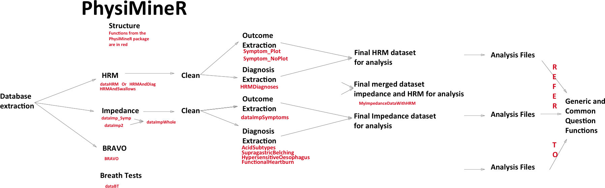

## Welcome to PhysiMineR


# 


PhysiMineR is a package written in R to help in the extraction, cleaning and analysis of upper GI physiology results. Once completed the package will provide the ability to extract results from a series of file formats and then clean the results so that diagnoses can be automated from the raw numbers. It should also be able to give cross patient analyses.

The current workflow with associated functions is shown the the diagram below:

# 

The package is divided into dta extraction, extrapolation and generic analyses functions

In addition there is a template associated with the package which will structure an abstract. 

The commonly asked questions in upper GI physiology are all contained within a folder called AnalysisFiles_Questions and subfolders are separated by condition and measurement type

In order to ask a question the user should create a new abstract template and then fill out each section.

The abstract template is separated into a data extraction and preparation section.

For example, if you want to assess HRM data, you wold extract first with

``` r dataHRM``` (extractng from the database) OR use the dummy data (HRMAll_Diag)

then clean it up with:

``` r
HRMAll_Diag2<-HRMCleanUp1(HRMAll_Diag)
```

Then the data can be used with the analysis functions

